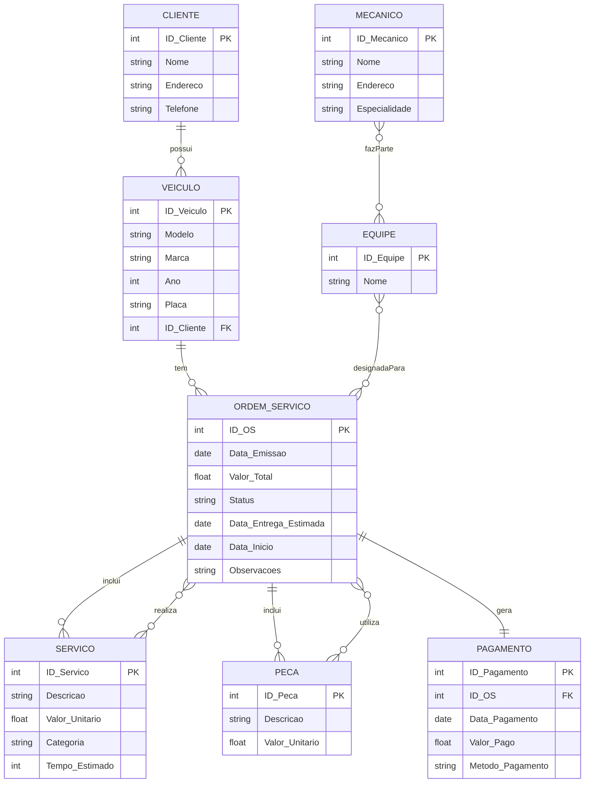

# Database Schema Concept for a Mechanical Workshop

This exercise consists of creating a conceptual schema for a service order control and management system in a mechanical workshop. The model covers the main entities, their attributes and the relationships between them, in addition to including an ER diagram in Mermaid format to visualize the interactions.

## Entidades e Atributos

### Cliente
- ID_Cliente
- Nome
- Endereço
- Telefone

### Veículo
- ID_Veículo
- Modelo
- Marca
- Ano
- Placa
- ID_Cliente

### Mecânico
- ID_Mecânico
- Nome
- Endereço
- Especialidade

### Equipe
- ID_Equipe
- Nome
- ID_Mecânico

### Ordem de Serviço (OS)
- ID_OS
- Data_Emissao
- Valor_Total
- Status
- Data_Entrega_Estimada
- Data_Inicio
- Observações

### Serviço
- ID_Serviço
- Descrição
- Valor_Unitario
- Categoria
- Tempo_Estimado

### Peça
- ID_Peça
- Descrição
- Valor_Unitario

### Pagamento
- ID_Pagamento
- ID_OS
- Data_Pagamento
- Valor_Pago
- Método_Pagamento

## Relacionamentos entre Entidades

1. **Cliente - Veículo**
   - Tipo: 1:N (Um para Muitos)
   - Descrição: Um cliente pode ter vários veículos registrados na oficina. Cada veículo está associado a um único cliente.

2. **Veículo - Ordem de Serviço (OS)**
   - Tipo: 1:N (Um para Muitos)
   - Descrição: Um veículo pode ter várias ordens de serviço ao longo do tempo, refletindo diferentes serviços realizados ou revisões periódicas. Cada ordem de serviço está vinculada a um único veículo.

3. **Ordem de Serviço (OS) - Serviço**
   - Tipo: 1:N (Um para Muitos)
   - Descrição: Uma ordem de serviço pode incluir vários serviços a serem executados. Cada serviço pode ser parte de apenas uma ordem de serviço específica.

4. **Serviço - Ordem de Serviço**
   - Tipo: N:M (Muitos para Muitos)
   - Descrição: Um serviço pode ser realizado em várias ordens de serviço diferentes, especialmente se for um serviço comum, como troca de óleo ou alinhamento. Da mesma forma, uma ordem de serviço pode incluir múltiplos serviços.

5. **Ordem de Serviço (OS) - Peça**
   - Tipo: 1:N (Um para Muitos)
   - Descrição: Uma ordem de serviço pode incluir várias peças necessárias para realizar os serviços. Cada peça pode ser utilizada em apenas uma ordem de serviço específica.

6. **Peça - Ordem de Serviço**
   - Tipo: N:M (Muitos para Muitos)
   - Descrição: Uma peça pode ser utilizada em várias ordens de serviço diferentes, especialmente se for uma peça comum que é frequentemente substituída ou reparada.

7. **Ordem de Serviço (OS) - Pagamento**
   - Tipo: 1:1 (Um para Um)
   - Descrição: Cada ordem de serviço deve ter um registro correspondente de pagamento, que indica que o cliente pagou pelos serviços e peças fornecidos. Não deve haver múltiplos pagamentos para uma única ordem de serviço.

8. **Mecânico - Equipe**
   - Tipo: N:M (Muitos para Muitos)
   - Descrição: Um mecânico pode fazer parte de várias equipes, e uma equipe pode conter vários mecânicos. Isso permite flexibilidade na alocação dos mecânicos às ordens de serviço conforme necessário.

9. **Equipe - Ordem de Serviço (OS)**
   - Tipo: N:M (Muitos para Muitos)
   - Descrição: Uma equipe pode ser designada para trabalhar em várias ordens de serviço, e uma ordem de serviço pode envolver várias equipes, especialmente em casos mais complexos que exigem diferentes especializações.

## Diagrama ER


# Database Schema:
```sql
CREATE TABLE Cliente (
    ID_Cliente INT PRIMARY KEY,
    Nome VARCHAR(100),
    Endereco VARCHAR(255),
    Telefone VARCHAR(15)
);

CREATE TABLE Veiculo (
    ID_Veiculo INT PRIMARY KEY,
    Modelo VARCHAR(50),
    Marca VARCHAR(50),
    Ano INT,
    Placa VARCHAR(10),
    ID_Cliente INT,
    FOREIGN KEY (ID_Cliente) REFERENCES Cliente(ID_Cliente)
);

CREATE TABLE Mecanico (
    ID_Mecanico INT PRIMARY KEY,
    Nome VARCHAR(100),
    Endereco VARCHAR(255),
    Especialidade VARCHAR(50)
);

CREATE TABLE Equipe (
    ID_Equipe INT PRIMARY KEY,
    Nome VARCHAR(100)
);

CREATE TABLE Ordem_Servico (
    ID_OS INT PRIMARY KEY,
    Data_Emissao DATE,
    Valor_Total FLOAT,
    Status VARCHAR(50),
    Data_Entrega_Estimada DATE,
    Data_Inicio DATE,
    Observacoes TEXT
    ID_Veiculo INT NOT NULL,
    FOREIGN KEY (ID_Veiculo) REFERENCES Veiculo(ID_Veiculo)
);

CREATE TABLE Servico (
    ID_Servico INT PRIMARY KEY,
    Descricao VARCHAR(255),
    Valor_Unitario FLOAT,
    Categoria VARCHAR(50),
    Tempo_Estimado INT
);

CREATE TABLE Peca (
    ID_Peca INT PRIMARY KEY,
    Descricao VARCHAR(255),
    Valor_Unitario FLOAT
);

CREATE TABLE Pagamento (
    ID_Pagamento INT PRIMARY KEY,
    ID_OS INT,
    Data_Pagamento DATE,
    Valor_Pago FLOAT,
    Metodo_Pagamento VARCHAR(50),
    FOREIGN KEY (ID_OS) REFERENCES Ordem_Servico(ID_OS)
);

CREATE TABLE Equipe_Mecanico (
    ID_Equipe INT,
    ID_Mecanico INT,
    PRIMARY KEY (ID_Equipe, ID_Mecanico),
    FOREIGN KEY (ID_Equipe) REFERENCES Equipe(ID_Equipe),
    FOREIGN KEY (ID_Mecanico) REFERENCES Mecanico(ID_Mecanico)
);

CREATE TABLE Ordem_Servico_Servico (
    ID_OS INT,
    ID_Servico INT,
    PRIMARY KEY (ID_OS, ID_Servico),
    FOREIGN KEY (ID_OS) REFERENCES Ordem_Servico(ID_OS),
    FOREIGN KEY (ID_Servico) REFERENCES Servico(ID_Servico)
);

CREATE TABLE Ordem_Servico_Peca (
    ID_OS INT,
    ID_Peca INT,
    PRIMARY KEY (ID_OS, ID_Peca),
    FOREIGN KEY (ID_OS) REFERENCES Ordem_Servico(ID_OS),
    FOREIGN KEY (ID_Peca) REFERENCES Peca(ID_Peca)
);

CREATE TABLE Equipe_Ordem_Servico (
    ID_Equipe INT,
    ID_OS INT,
    PRIMARY KEY (ID_Equipe, ID_OS),
    FOREIGN KEY (ID_Equipe) REFERENCES Equipe(ID_Equipe),
    FOREIGN KEY (ID_OS) REFERENCES Ordem_Servico(ID_OS)
);
```
## Data Persistence
Criação de dados fictícios para testes.

```sql
-- Dados para Cliente
INSERT INTO Cliente VALUES (1, 'João Silva', 'Rua A, 123', '11999999999');

-- Dados para Veiculo
INSERT INTO Veiculo VALUES (1, 'Civic', 'Honda', 2020, 'ABC1234', 1);

-- Dados para Mecanico
INSERT INTO Mecanico VALUES (1, 'Carlos Souza', 'Rua B, 456', 'Suspensão');

-- Dados para Equipe
INSERT INTO Equipe VALUES (1, 'Equipe A');

-- Dados para Ordem_Servico
INSERT INTO Ordem_Servico VALUES (1, '2025-01-01', 1000.00, 'Aberta', '2025-01-10', '2025-01-02', 'Troca de óleo', 1);

-- Dados para Servico
INSERT INTO Servico VALUES (1, 'Troca de Óleo', 150.00, 'Manutenção', 2);

-- Dados para Peca
INSERT INTO Peca VALUES (1, 'Filtro de Óleo', 50.00);

-- Dados para Pagamento
INSERT INTO Pagamento VALUES (1, 1, '2025-01-02', 1000.00, 'Cartão');

-- Relacionamentos
INSERT INTO Ordem_Servico_Servico VALUES (1, 1);
INSERT INTO Ordem_Servico_Peca VALUES (1, 1);
INSERT INTO Mecanico_Equipe VALUES (1, 1);
INSERT INTO Equipe_Ordem_Servico VALUES (1, 1);
```
## Recuperação com subquery (ordem de serviço mais recente de cada cliente):
   ```sql
   SELECT Cliente.Nome, Ordem_Servico.ID_OS, Ordem_Servico.Data_Emissao
   FROM Cliente
   JOIN Veiculo ON Cliente.ID_Cliente = Veiculo.ID_Cliente
   JOIN Ordem_Servico ON Veiculo.ID_Veiculo = Ordem_Servico.ID_Veiculo
   WHERE Ordem_Servico.Data_Emissao = (
      SELECT MAX(Data_Emissao)
      FROM Ordem_Servico OS2
      WHERE OS2.ID_Veiculo = Veiculo.ID_Veiculo
   );
   ```
## Contagem de mecânicos por especialidade:
   ```sql
   SELECT Especialidade, COUNT(*) AS Total_Mecanicos
   FROM Mecanico
   GROUP BY Especialidade;
   ```
## Cálculo do valor total de serviços por ordem de serviço:
   ```sql
   SELECT Ordem_Servico.ID_OS, SUM(Servico.Valor_Unitario) AS Total_Servicos
   FROM Ordem_Servico
   JOIN Ordem_Servico_Servico ON Ordem_Servico.ID_OS = Ordem_Servico_Servico.ID_OS
   JOIN Servico ON Ordem_Servico_Servico.ID_Servico = Servico.ID_Servico
   GROUP BY Ordem_Servico.ID_OS;
   ```
## Listagem de peças usadas em ordens de serviço concluídas:
   ```sql
   SELECT Ordem_Servico.ID_OS, Peca.Descricao, Peca.Valor_Unitario
   FROM Ordem_Servico
   JOIN Ordem_Servico_Peca ON Ordem_Servico.ID_OS = Ordem_Servico_Peca.ID_OS
   JOIN Peca ON Ordem_Servico_Peca.ID_Peca = Peca.ID_Peca
   WHERE Ordem_Servico.Status = 'Concluída';
   ```
## Média de tempo estimado de serviços por categoria:
   ```sql
   SELECT Categoria, AVG(Tempo_Estimado) AS Media_Tempo_Estimado
   FROM Servico
   GROUP BY Categoria;
   ```