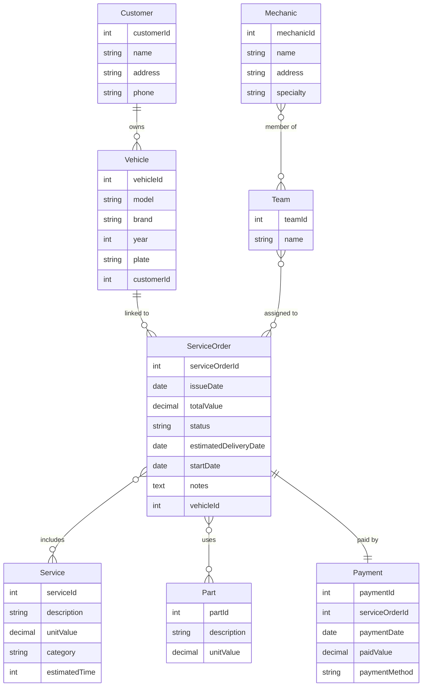

# 🚗 Mechanical Workshop Service Orders – Database Schema

<p align="center"> </p>

**This project provides a refined, relational database schema for managing service orders in mechanical workshops. It demonstrates best practices in entity-relationship modeling, advanced SQL features (constraints, triggers, views), and serves both as a study reference and an impressive portfolio piece.**

---

## 📊 ER Diagram (English Notation)

The diagram below maps out all the main entities of a professional mechanical workshop management system.  
Each entity contains only attribute names (no types or constraint hints; see SQL section).  
Relationship lines show cardinality and are labeled for clarity.



### 📝 Diagram Description

- **Customer**: Workshop clients; each can own multiple vehicles.
- **Vehicle**: Each car, motorbike etc. belonging to a customer.
- **Mechanic**: Professionals with various specialties; can be on multiple teams.
- **Team**: Groups of mechanics, assigned to complex service orders as needed.
- **ServiceOrder**: Core business document, linked to a vehicle; includes services, parts, payment, and teams.
- **Service**: Task types carried out (e.g., oil change, alignment).
- **Part**: Consumables or replaced items in orders.
- **Payment**: One-to-one with service order, records order payment info.
- **Associative Relations**: N:M relations between mechanic/team, team/service_order, service_order/service, service_order/part.

---

## 🗄️ SQL Schema (PostgreSQL, English Notation)

```sql
CREATE TABLE Customer (
    customerId SERIAL PRIMARY KEY,
    name VARCHAR(100) NOT NULL,
    address VARCHAR(255),
    phone VARCHAR(20)
);

CREATE TABLE Vehicle (
    vehicleId SERIAL PRIMARY KEY,
    model VARCHAR(50) NOT NULL,
    brand VARCHAR(50) NOT NULL,
    year INT CHECK (year >= 1900),
    plate VARCHAR(10) NOT NULL UNIQUE,
    customerId INT NOT NULL REFERENCES Customer(customerId)
        ON UPDATE CASCADE ON DELETE CASCADE
);

CREATE TABLE Mechanic (
    mechanicId SERIAL PRIMARY KEY,
    name VARCHAR(100) NOT NULL,
    address VARCHAR(255),
    specialty VARCHAR(50) NOT NULL
);

CREATE TABLE Team (
    teamId SERIAL PRIMARY KEY,
    name VARCHAR(100) NOT NULL
);

CREATE TABLE ServiceOrder (
    serviceOrderId SERIAL PRIMARY KEY,
    issueDate DATE NOT NULL,
    totalValue DECIMAL(10,2) DEFAULT 0,
    status VARCHAR(20) NOT NULL CHECK (status IN ('Open', 'In Progress', 'Closed', 'Cancelled')),
    estimatedDeliveryDate DATE,
    startDate DATE NOT NULL,
    notes TEXT,
    vehicleId INT NOT NULL REFERENCES Vehicle(vehicleId)
        ON UPDATE CASCADE ON DELETE CASCADE
);

CREATE TABLE Service (
    serviceId SERIAL PRIMARY KEY,
    description VARCHAR(255) NOT NULL,
    unitValue DECIMAL(10,2) NOT NULL,
    category VARCHAR(50) NOT NULL,
    estimatedTime INT CHECK(estimatedTime >= 0)
);

CREATE TABLE Part (
    partId SERIAL PRIMARY KEY,
    description VARCHAR(255) NOT NULL,
    unitValue DECIMAL(10,2) NOT NULL
);

CREATE TABLE Payment (
    paymentId SERIAL PRIMARY KEY,
    serviceOrderId INT NOT NULL UNIQUE REFERENCES ServiceOrder(serviceOrderId)
         ON UPDATE CASCADE ON DELETE CASCADE,
    paymentDate DATE NOT NULL,
    paidValue DECIMAL(10,2) NOT NULL CHECK (paidValue >= 0),
    paymentMethod VARCHAR(20) NOT NULL CHECK (paymentMethod IN ('Cash', 'Card', 'Pix', 'Check', 'Other'))
);

CREATE TABLE TeamMechanic (
    teamId INT NOT NULL REFERENCES Team(teamId) ON DELETE CASCADE,
    mechanicId INT NOT NULL REFERENCES Mechanic(mechanicId) ON DELETE CASCADE,
    PRIMARY KEY (teamId, mechanicId)
);

CREATE TABLE ServiceOrderService (
    serviceOrderId INT NOT NULL REFERENCES ServiceOrder(serviceOrderId) ON DELETE CASCADE,
    serviceId INT NOT NULL REFERENCES Service(serviceId) ON DELETE CASCADE,
    PRIMARY KEY (serviceOrderId, serviceId)
);

CREATE TABLE ServiceOrderPart (
    serviceOrderId INT NOT NULL REFERENCES ServiceOrder(serviceOrderId) ON DELETE CASCADE,
    partId INT NOT NULL REFERENCES Part(partId) ON DELETE CASCADE,
    PRIMARY KEY (serviceOrderId, partId)
);

CREATE TABLE TeamServiceOrder (
    teamId INT NOT NULL REFERENCES Team(teamId) ON DELETE CASCADE,
    serviceOrderId INT NOT NULL REFERENCES ServiceOrder(serviceOrderId) ON DELETE CASCADE,
    PRIMARY KEY (teamId, serviceOrderId)
);

-- Recommended index samples for performance:
CREATE INDEX idx_vehicle_customerId ON Vehicle(customerId);
CREATE INDEX idx_serviceOrder_vehicleId ON ServiceOrder(vehicleId);
CREATE INDEX idx_serviceOrder_status ON ServiceOrder(status);
CREATE INDEX idx_service_category ON Service(category);

-- See the advanced section for triggers and views.
```

---

## 📚 Sample Data (Persistence Example)

```sql
INSERT INTO Customer (name, address, phone) VALUES ('John Smith', 'First Avenue, 123', '11999999999');
INSERT INTO Vehicle (model, brand, year, plate, customerId) VALUES ('Civic', 'Honda', 2020, 'ABC1234', 1);
INSERT INTO Mechanic (name, address, specialty) VALUES ('Carl Brown', 'Second Street, 456', 'Suspension');
INSERT INTO Team (name) VALUES ('Team A');
INSERT INTO ServiceOrder (issueDate, totalValue, status, estimatedDeliveryDate, startDate, notes, vehicleId) VALUES ('2025-01-01', 1000.00, 'Open', '2025-01-10', '2025-01-02', 'Oil change', 1);
INSERT INTO Service (description, unitValue, category, estimatedTime) VALUES ('Oil Change', 150.00, 'Maintenance', 2);
INSERT INTO Part (description, unitValue) VALUES ('Oil Filter', 50.00);
INSERT INTO Payment (serviceOrderId, paymentDate, paidValue, paymentMethod) VALUES (1, '2025-01-02', 1000.00, 'Card');
-- Association tables:
INSERT INTO ServiceOrderService VALUES (1, 1);
INSERT INTO ServiceOrderPart VALUES (1, 1);
INSERT INTO TeamMechanic VALUES (1, 1);
INSERT INTO TeamServiceOrder VALUES (1, 1);
```

---

## 📉 Advanced Queries

```sql
-- Most recent service order per customer
SELECT c.name, so.serviceOrderId, so.issueDate
FROM Customer c
JOIN Vehicle v ON c.customerId = v.customerId
JOIN ServiceOrder so ON v.vehicleId = so.vehicleId
WHERE so.issueDate = (
   SELECT MAX(issueDate)
   FROM ServiceOrder so2
   WHERE so2.vehicleId = v.vehicleId
);

-- Mechanic count by specialty
SELECT specialty, COUNT(*) AS totalMechanics
FROM Mechanic
GROUP BY specialty;

-- Service total per order
SELECT so.serviceOrderId, SUM(s.unitValue) AS totalServices
FROM ServiceOrder so
JOIN ServiceOrderService sos ON so.serviceOrderId = sos.serviceOrderId
JOIN Service s ON sos.serviceId = s.serviceId
GROUP BY so.serviceOrderId;

-- Parts used in completed orders
SELECT so.serviceOrderId, p.description, p.unitValue
FROM ServiceOrder so
JOIN ServiceOrderPart sop ON so.serviceOrderId = sop.serviceOrderId
JOIN Part p ON sop.partId = p.partId
WHERE so.status = 'Closed';

-- Average estimated time by service category
SELECT category, AVG(estimatedTime) AS avgEstimatedTime
FROM Service
GROUP BY category;
```

---

## 🏆 Advanced Features

**Consolidated VIEW for Service Orders:**
```sql
CREATE VIEW vw_service_order_full AS
SELECT
  so.serviceOrderId,
  so.issueDate,
  c.name AS customer,
  v.plate AS vehicle,
  so.status,
  so.totalValue,
  COALESCE(SUM(s.unitValue), 0) AS totalServices,
  COALESCE(SUM(p.unitValue), 0) AS totalParts,
  COALESCE(pa.paidValue, 0) AS paidValue
FROM ServiceOrder so
JOIN Vehicle v ON so.vehicleId = v.vehicleId
JOIN Customer c ON v.customerId = c.customerId
LEFT JOIN ServiceOrderService sos ON so.serviceOrderId = sos.serviceOrderId
LEFT JOIN Service s ON sos.serviceId = s.serviceId
LEFT JOIN ServiceOrderPart sop ON so.serviceOrderId = sop.serviceOrderId
LEFT JOIN Part p ON sop.partId = p.partId
LEFT JOIN Payment pa ON so.serviceOrderId = pa.serviceOrderId
GROUP BY so.serviceOrderId, so.issueDate, c.name, v.plate, so.status, so.totalValue, pa.paidValue;
```

**Trigger: Automatic totalValue calculation example**
```sql
CREATE OR REPLACE FUNCTION update_service_order_total()
RETURNS TRIGGER AS $$
DECLARE
  total_services DECIMAL(10,2);
  total_parts DECIMAL(10,2);
BEGIN
  SELECT COALESCE(SUM(s.unitValue), 0)
    INTO total_services
    FROM ServiceOrderService sos
    JOIN Service s ON sos.serviceId = s.serviceId
    WHERE sos.serviceOrderId = NEW.serviceOrderId;
  SELECT COALESCE(SUM(p.unitValue), 0)
    INTO total_parts
    FROM ServiceOrderPart sop
    JOIN Part p ON sop.partId = p.partId
    WHERE sop.serviceOrderId = NEW.serviceOrderId;
  UPDATE ServiceOrder SET totalValue = total_services + total_parts
    WHERE serviceOrderId = NEW.serviceOrderId;
  RETURN NEW;
END;
$$ LANGUAGE plpgsql;

CREATE TRIGGER trg_update_service_order_total_service
AFTER INSERT OR DELETE ON ServiceOrderService
FOR EACH ROW EXECUTE PROCEDURE update_service_order_total();

CREATE TRIGGER trg_update_service_order_total_part
AFTER INSERT OR DELETE ON ServiceOrderPart
FOR EACH ROW EXECUTE PROCEDURE update_service_order_total();
```

---

## 💡 Portfolio Quality Highlights

- All entities, attributes, and relationships named in English, industry-consistent and recruiter-friendly.
- Consistent PK/FK notation, normalized and with integrity constraints.
- Uses PostgreSQL auto-increment (`SERIAL`) for PKs to streamline sample data insertion.
- Strong domain rules via `CHECK` constraints and `UNIQUE`.
- ON DELETE/UPDATE CASCADE for automatic referential integrity.
- Example data is diverse and realistic.
- Query, view, and trigger advanced features for high-end showcase.
- Mermaid ER diagram compatible for direct rendering.

---

## 🎯 How to use

1. Run all SQL scripts above in your PostgreSQL environment.
2. Explore/modify the queries and entities per your business needs.

---

## 📄 License

Licensed under the [MIT License](LICENSE).

---

<p align="center">
  <a href="https://www.linkedin.com/in/pedrosolozabal/">
    
  </a>
</p>